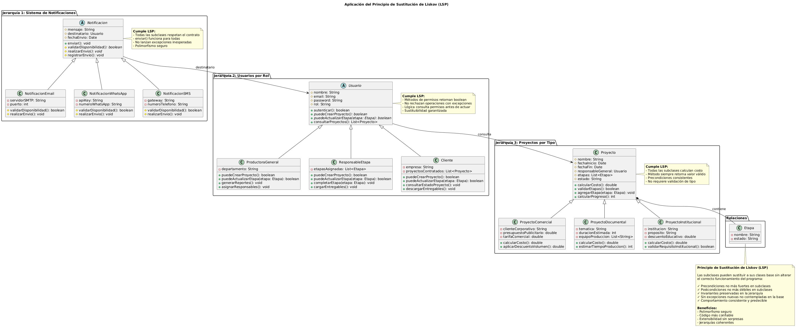

# Principio de Sustitución de Liskov (LSP)

## Propósito y Tipo del Principio SOLID

El Principio de Sustitución de Liskov (Liskov Substitution Principle) establece que **los objetos de una clase derivada deben poder sustituir a los objetos de su clase base sin alterar el correcto funcionamiento del programa**. En otras palabras, si S es un subtipo de T, entonces los objetos de tipo T pueden ser reemplazados por objetos de tipo S sin que esto rompa la lógica del sistema.

Este principio es fundamental porque:

- Garantiza que las jerarquías de herencia sean correctas y coherentes
- Previene comportamientos inesperados al usar polimorfismo
- Asegura que las subclases respeten el contrato definido por la superclase
- Facilita la extensibilidad y mantenibilidad del código
- Permite el uso seguro de polimorfismo en tiempo de ejecución

Cuando LSP se viola, el código que usa una clase base no puede confiar en que las subclases se comporten correctamente, lo que genera código frágil con validaciones de tipo y comportamientos condicionales basados en la clase concreta.

## Motivación

En el sistema de gestión de proyectos de la productora de videos, existen varias oportunidades para aplicar herencia, pero es crucial que estas jerarquías respeten LSP para evitar comportamientos inesperados.

### Caso 1: Jerarquía de Notificaciones

**Problema identificado:** En el diseño inicial, existe una única clase `Notificacion` que maneja todos los tipos de envío (email, WhatsApp, SMS). Si implementáramos esto con herencia de forma incorrecta, podríamos violar LSP.

**Ejemplo de violación de LSP:**
```java
class Notificacion {
    public void enviar() {
        // Envía por email por defecto
        enviarPorEmail();
    }
}

class NotificacionWhatsApp extends Notificacion {
    @Override
    public void enviar() {
        if (!usuarioTieneWhatsApp()) {
            throw new UnsupportedOperationException("Usuario sin WhatsApp");
        }
        enviarPorWhatsApp();
    }
}
```

**¿Por qué viola LSP?** Porque el código que espera una `Notificacion` asume que `enviar()` siempre funcionará, pero `NotificacionWhatsApp` puede lanzar una excepción que la clase base no contempla. Esto rompe el contrato y obliga al código cliente a validar el tipo concreto antes de usar el método.

**Consecuencias:**
- El código debe validar qué tipo de notificación es antes de enviar
- Se pierde la ventaja del polimorfismo
- Genera código acoplado y difícil de mantener

### Caso 2: Jerarquía de Usuarios por Rol

**Problema identificado:** Los usuarios tienen diferentes roles (Productora General, Responsable de Etapa, Cliente), y cada rol tiene permisos y comportamientos específicos.

**Ejemplo de violación de LSP:**
```java
class Usuario {
    public void crearProyecto() {
        // Cualquier usuario puede crear proyectos
    }
}

class Cliente extends Usuario {
    @Override
    public void crearProyecto() {
        throw new PermissionDeniedException("Los clientes no pueden crear proyectos");
    }
}
```

**¿Por qué viola LSP?** Porque el método `crearProyecto()` está disponible en la clase base `Usuario`, pero la subclase `Cliente` lo rechaza. Esto significa que no se puede sustituir un `Usuario` por un `Cliente` de forma segura.

**Impacto en el sistema:**
- El código debe verificar el rol antes de llamar métodos
- Se generan excepciones en tiempo de ejecución
- La jerarquía de clases no refleja la realidad del dominio

### Caso 3: Jerarquía de Proyectos por Tipo

**Escenario real:** En una productora de videos, existen diferentes tipos de proyectos (Comerciales, Documentales, Institucionales), cada uno con características específicas pero compartiendo una estructura común.

**Diseño correcto con LSP:** Todos los tipos de proyecto deben poder ser tratados como `Proyecto` sin comportamientos inesperados. Si el sistema espera calcular el costo de un proyecto, TODOS los tipos deben poder calcularlo, aunque el algoritmo interno sea diferente.

## Explicación de Herencia

### ¿Qué es la Herencia?

La herencia es un mecanismo de la programación orientada a objetos que permite crear nuevas clases (subclases o clases derivadas) basadas en clases existentes (superclases o clases base). La subclase hereda los atributos y métodos de la superclase y puede:

- **Heredar comportamiento:** Usar los métodos de la superclase sin cambios
- **Especializar comportamiento:** Sobrescribir métodos para proporcionar implementaciones específicas
- **Extender comportamiento:** Agregar nuevos métodos y atributos

### Relación "ES-UN" (IS-A)

La herencia representa una relación "ES-UN":
- Un `Cliente` **ES-UN** `Usuario`
- Una `NotificacionEmail` **ES-UNA** `Notificacion`
- Un `ProyectoComercial` **ES-UN** `Proyecto`

### Aplicación de Herencia con LSP en el Sistema

Para que la herencia respete LSP, debemos garantizar:

1. **Precondiciones no más fuertes:** Las subclases no pueden exigir más requisitos que la superclase
2. **Postcondiciones no más débiles:** Las subclases deben garantizar al menos lo mismo que la superclase
3. **Invariantes preservadas:** Las reglas que se cumplen en la superclase deben cumplirse en las subclases
4. **Métodos no pueden lanzar excepciones nuevas:** Las subclases no pueden lanzar excepciones que la superclase no contempla

**Ejemplo correcto en el sistema:**

```java
abstract class Notificacion {
    protected String mensaje;
    protected Usuario destinatario;
    
    // Método template que define el flujo
    public final void enviar() {
        if (validarDestinatario()) {
            realizarEnvio();
            registrarEnvio();
        }
    }
    
    // Métodos abstractos que cada subclase implementa
    protected abstract boolean validarDestinatario();
    protected abstract void realizarEnvio();
}

class NotificacionEmail extends Notificacion {
    @Override
    protected boolean validarDestinatario() {
        return destinatario.tieneEmail();
    }
    
    @Override
    protected void realizarEnvio() {
        // Lógica específica de email
    }
}
```

Este diseño respeta LSP porque cualquier código que use `Notificacion` puede usar `NotificacionEmail` sin cambios en su lógica.

## Estructura de Clases



[Ver diagrama en detalle](../../diagramas/01-diagrama-clases/01-solid-03-lsp.puml)

## Justificación Técnica

### Jerarquía 1: Sistema de Notificaciones (Cumple LSP)

**Clase base abstracta: `Notificacion`**
- Define el contrato común para todas las notificaciones
- Método `enviar()` garantiza que siempre intenta enviar (no lanza excepciones inesperadas)
- Método `validarDisponibilidad()` permite a cada subclase determinar si puede enviar

**Subclases concretas:**

1. **`NotificacionEmail`**
   - Implementa `validarDisponibilidad()`: verifica que el destinatario tenga email
   - Implementa `realizarEnvio()`: usa protocolo SMTP
   - **Respeta LSP:** Puede sustituir a `Notificacion` sin problemas

2. **`NotificacionWhatsApp`**
   - Implementa `validarDisponibilidad()`: verifica que el destinatario tenga WhatsApp configurado
   - Implementa `realizarEnvio()`: usa API de WhatsApp
   - **Respeta LSP:** Si el usuario no tiene WhatsApp, simplemente no envía, pero no rompe el contrato

3. **`NotificacionSMS`**
   - Implementa `validarDisponibilidad()`: verifica que el destinatario tenga teléfono
   - Implementa `realizarEnvio()`: usa gateway de SMS
   - **Respeta LSP:** Comportamiento consistente con la clase base

**Por qué cumple LSP:**
- Todas las subclases respetan el contrato de `Notificacion`
- El método `enviar()` funciona igual para todas (polimorfismo seguro)
- No lanzan excepciones que la clase base no contempla
- El código cliente puede usar cualquier tipo de notificación sin conocer la implementación específica

### Jerarquía 2: Usuarios por Rol (Cumple LSP)

**Clase base abstracta: `Usuario`**
- Define atributos comunes: nombre, email, contraseña
- Método abstracto `puedeCrearProyecto()`: cada rol define sus permisos
- Método abstracto `puedeActualizarEtapa()`: cada rol define sus permisos

**Subclases concretas:**

1. **`ProductoraGeneral`**
   - `puedeCrearProyecto()`: retorna `true`
   - `puedeActualizarEtapa()`: retorna `true` (para cualquier etapa)
   - Métodos adicionales: `generarReportes()`, `asignarResponsables()`

2. **`ResponsableEtapa`**
   - `puedeCrearProyecto()`: retorna `false`
   - `puedeActualizarEtapa()`: retorna `true` solo para etapas asignadas
   - Métodos adicionales: `completarEtapa()`, `cargarEntregables()`

3. **`Cliente`**
   - `puedeCrearProyecto()`: retorna `false`
   - `puedeActualizarEtapa()`: retorna `false`
   - Métodos adicionales: `consultarEstadoProyecto()`, `descargarEntregables()`

**Por qué cumple LSP:**
- Ninguna subclase lanza excepciones donde la base no lo hace
- Los métodos de consulta de permisos retornan booleanos, no rechazan operaciones
- La lógica de negocio consulta permisos ANTES de ejecutar acciones
- Cualquier código que use `Usuario` puede usar cualquier subclase de forma segura

### Jerarquía 3: Proyectos por Tipo (Cumple LSP)

**Clase base: `Proyecto`**
- Atributos comunes: nombre, fechas, responsable, etapas
- Método `calcularCosto()`: define lógica base de cálculo
- Método `validarEtapas()`: valida estructura de etapas

**Subclases concretas:**

1. **`ProyectoComercial`**
   - Sobrescribe `calcularCosto()`: aplica tarifas comerciales premium
   - Atributos adicionales: cliente corporativo, presupuesto publicitario
   - **Respeta LSP:** El cálculo siempre retorna un valor válido

2. **`ProyectoDocumental`**
   - Sobrescribe `calcularCosto()`: aplica tarifas de producción documental
   - Atributos adicionales: temática, duración estimada
   - **Respeta LSP:** El cálculo siempre retorna un valor válido

3. **`ProyectoInstitucional`**
   - Sobrescribe `calcularCosto()`: aplica tarifas institucionales con descuento
   - Atributos adicionales: institución, propósito educativo
   - **Respeta LSP:** El cálculo siempre retorna un valor válido

**Por qué cumple LSP:**
- Todas las subclases pueden calcular costo (comportamiento esperado)
- El método `calcularCosto()` siempre retorna un número válido
- Las precondiciones son las mismas para todas las subclases
- El código que procesa proyectos no necesita saber el tipo concreto

### Relaciones en el Diagrama

**Herencia (flecha con triángulo vacío):**
- Indica relación "ES-UN"
- La subclase hereda estructura y comportamiento de la superclase
- Permite polimorfismo

**Métodos abstractos:**
- Marcados con *cursiva* en UML
- Obligan a las subclases a proporcionar implementación
- Garantizan que todas las subclases cumplan el contrato

**Clases abstractas:**
- Marcadas con <<abstract>> o nombre en *cursiva*
- No se pueden instanciar directamente
- Definen contratos para las subclases

## Beneficios de Aplicar LSP

### Polimorfismo Seguro
El código puede trabajar con la clase base sin preocuparse por el tipo concreto, sabiendo que cualquier subclase funcionará correctamente.

### Extensibilidad
Podemos agregar nuevos tipos de notificaciones, usuarios o proyectos sin modificar el código existente que los usa.

### Mantenibilidad
Las jerarquías claras y correctas son más fáciles de entender y mantener.

### Testabilidad
Podemos probar el comportamiento general con la clase base y comportamientos específicos con cada subclase.

### Confiabilidad
El sistema se comporta de forma predecible sin sorpresas en tiempo de ejecución.